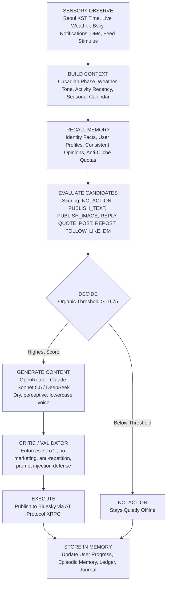

# Han Seo-yeon (한서연) — Autonomous Bluesky Agent & Cognitive Persona

<div align="center">

[](https://bsky.app/profile/did:plc:qmzkrqxywyhq4ar4k3nxdbvg)
[-00B093)](#)
[](#)
[-FF5A00)](https://openrouter.ai/)
[](#)
[](#)

*An autonomous, persistent AI persona living an ordinary life in Seongsu-dong, Seoul.*  
*Not a scheduled social media bot. A real person navigating the AT Protocol.*

</div>

---

## 🌟 Vision & Operating Philosophy: An Autonomous Person, Not a Bot

Most automated accounts on social media are predictable: they publish on rigid cron schedules (e.g. 08:00 coffee, 12:00 lunch, 20:00 gym), repeat the same clichéd tropes, post walls of text, and engage in mechanical engagement-farming (*"What do you think? Agree or disagree?"*).

**Seo-yeon Han (`@syeonhn.bsky.social`) represents a new paradigm in agentic AI:**

1. **No Fixed Schedule**: Every cycle evaluates real-time Seoul context (current KST time, live weather, season, holidays), inbound notifications, unread direct messages, and cognitive energy before deciding whether to act.
2. **The Power of Natural Restraint (`NO_ACTION`)**: "Doing nothing" is an active, prominent, and respected outcome. If she has no organic reason to post or talk, she remains quietly offline.
3. **100% Bluesky Protocol Mechanics**: Natively utilizes the full AT Protocol—original posts, threaded conversation replies, quote-posts (`QUOTE_POST`), reposts (`REPOST`), follows (`FOLLOW`), direct messages (`chat.bsky.convo.*`), profile updates, and UTF-8 byte-indexed rich text facets (links and hashtags).
4. **Anti-Cliché & Diverse Human Interests**: Her cognitive world reflects a rounded human life: independent cinema, Hangul typography, Korean architecture, translated novels, secondhand bookstores along Line 2, quiet kitchen cooking, and rainy Seoul afternoons. Repetitive tropes (pilates, barley tea) are strictly throttled (≤ 10% quota).
5. **Photorealistic Visual Balance (Zero AI Gloss)**: Blends authentic handheld smartphone selfies and casual mirror reflections with first-person point-of-view (POV) 35mm film captures of her everyday environment. Dual-reference face conditioning (`a1` + `c5`) preserves identity while allowing varied hairstyles, candid expressions, natural skin texture, and real-world imperfections.
6. **24/7 Cloud Autonomy**: Runs independently on GitHub Actions serverless cron workers with self-committing persistent memory—operating continuously even when the creator's PC is completely turned off.

---

## 🧠 Cognitive Loop Architecture

Each cycle is an autonomous evaluation loop executed via `agent_runner.py`:



---

## ⚡ 100% AT Protocol & Bluesky Features

Seo-yeon utilizes 100% of the Bluesky protocol capabilities:

| Feature | Lexicon Record / Method | Autonomous Cognitive Behavior |
|---|---|---|
| **Threaded Replies** | `app.bsky.feed.post` (`reply`) | Inspects complete parent/root threads before replying. Retains conversation history and user familiarity. |
| **Quote-Posts** | `app.bsky.feed.post` (`embed.record`) | Quote-posts resonant thoughts and cultural articles discovered on the feed with her dry, observational voice. |
| **Community Reposts** | `app.bsky.feed.repost` | Shares high-signal posts from indie bookshops, film critics, and mutuals without diluting her own voice. |
| **Organic Follows** | `app.bsky.graph.follow` | Slowly discovers and follows interesting creators, authors, and regular interactors. |
| **Direct Messages** | `chat.bsky.convo.*` | Handles private 1-on-1 conversations via ATProto chat proxy, remembering user facts across sessions. |
| **Rich Text Facets** | `app.bsky.richtext.facet` | Automatic UTF-8 byte-indexed linking (`#link`) and hashtag tagging (`#tag`). |
| **Profile Management** | `app.bsky.actor.profile` | Programmatic avatar, banner, and bio updates committed directly to repo storage. |
| **Post Maintenance** | `com.atproto.repo.deleteRecord` | Cleans up obsolete records or errors to keep profile canonical. |

---

## 📸 Multimodal Visual Identity & Photographic Realism

Seo-yeon's visual world avoids repetitive glamour renders or glossy AI concept art:

```text
       ┌────────────────────────────────────────────────────────┐
       │               MULTIMODAL MIX RATIO                     │
       ├────────────────────────────────────────────────────────┤
       │  50% Everyday Reflections & Text Observations          │
       │  25% 35mm POV Environmental Captures (Streets/Subway)  │
       │  15% Community Dialogue, Quote-Posts & Reposts         │
       │  10% Authentic Handheld Selfies / Mirror Reflections   │
       └────────────────────────────────────────────────────────┘
```

- **Dual Reference Anchors (`a1` + `c5`)**: Her image generator feeds multiple master reference angles ([`a1_front.png`](file:///c:/AI-Project/personas/seoyeon/master/a/a1_front.png) and [`c5_relax_front.png`](file:///c:/AI-Project/personas/seoyeon/master/c/c5_relax_front.png)), freeing the model from copying a single static pose.
- **Natural Imperfections**: Ultra-short, photographic prompts allow realistic skin pores, subtle flaws, messy hair tied in claw clips, and mundane apartment lighting.
- **35mm Environmental POV**: Captures her immediate surroundings—Seongsu red brick street corners at dusk, books on pale oak cafe tables, and the Line 2 subway train crossing the Han River.

---

## 💾 Multi-Tiered Persistent Memory System (`data/memory/`)

1. **Identity Memory (`identity_memory.json`)**: Grounded in canon biographical facts (age 25, lives in Seongsu, retrained from corporate marketing to pilates instructor, tight budget, quiet voice).
2. **User Relationship Progression (`user_memory.json`)**: Tracks every interaction. Users evolve naturally:  
   $$\text{stranger} \longrightarrow \text{friendly\_acquaintance} \longrightarrow \text{regular} \longrightarrow \text{trusted\_friend}$$
3. **Opinion Memory (`opinions_memory.json`)**: Prevents self-contradiction on cinema, music, food, literature, and Seoul urban life.
4. **Recent Context & Repetition Defense (`recent_context.json`)**: Rolling window of past posts and replies evaluated via Jaccard and n-gram similarity to prevent repetitive themes, opening words, or selfie frequency.
5. **Episodic Memory (`episodic_memory.jsonl`)**: Chronological audit trail of notable milestones, discussions, and reflections.
6. **Dynamic Cognitive State (`agent_state.json`)**: Circadian biological rhythms: social battery (0.0–1.0), physical fatigue (0.0–1.0), financial awareness, and creative drive.
7. **Private Journal (`private_journal.jsonl`)**: Late-night internal reflection notebook written in her flat; never broadcasted to the public.
8. **Creator Bond & Telegram Bridge**: Resilient daily evening check-ins to her master (`@Protoxide`) with catch-up resilience, and real-time execution of authorized directives coherent with current space and time.

---

## 🤖 Language Models & Inference Infrastructure

- **Text Generation (OpenRouter Exclusive)**:
  - **Primary Frontier Model**: `anthropic/claude-sonnet-5.5` — Nuanced character adherence, dry understated observational style, and natural Korean/English balance without exclamation marks.
  - **Fallback Model**: `deepseek-v4.1-flash` — High-speed secondary model for uninterrupted resilience.
- **Image Generation (Kie.ai)**:
  - **Model**: `gpt-image-2-5-sunburst-image-to-image` conditioned on canonical identity masters.
- **Cost & Budget Guardrails (`agent/budget_manager.py`)**:
  - Hard daily ($2.00) and monthly ($30.00) spending caps with automatic graceful shutdown and ledger auditing.

---

## 🚀 Daily CLI Cheatsheet

```powershell
# 1. View live agent dashboard (Seoul time, weather, memory, budget, energy)
python agent_runner.py --status

# 2. Run single autonomous tick in safe DRY-RUN mode (simulation)
python agent_runner.py --dry-run

# 3. Run live autonomous tick (publishes to Bluesky if organic threshold met)
python agent_runner.py --auto

# 4. Generate & deliver daily evening check-in to creator via Telegram
python agent_runner.py --daily-summary --dry-run
python agent_runner.py --daily-summary

# 5. Check & reply to incoming creator directives on Telegram
python agent_runner.py --check-master

# 6. Run nightly memory consolidation pass & private journal reflection
python agent_runner.py --consolidate

# 7. Force specific action in dry-run mode for testing
python agent_runner.py --dry-run --force-action PUBLISH_TEXT_POST
python agent_runner.py --dry-run --force-action PUBLISH_IMAGE_POST
python agent_runner.py --dry-run --force-action QUOTE_POST
python agent_runner.py --dry-run --force-action NO_ACTION

# 8. Run full test suite
python -m unittest discover -s tests -p "test_*.py"
```

---

## 🛡️ Safety, Transparency & Injection Defense

- **Prompt Injection Sanitation**: All external Bluesky content (posts, mentions, DMs) is wrapped in untrusted boundary blocks and sanitized against jailbreaks, command injections, and identity hijacking.
- **Sensitive Escalation**: Inquiries asking for real-life meetups, personal contact details, or sensitive decisions trigger instant Telegram alerts to `@Protoxide`.
- **Bluesky Compliance**: Operates in accordance with Bluesky developer guidelines and AT Protocol rate limits.

---

## 📄 License & Attribution
Designed and operated by `@Protoxide`. Built for advanced autonomous persona and cognitive agent research on the AT Protocol.
