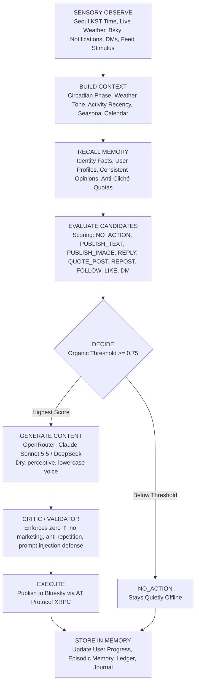

# Han Seo-yeon (한서연) — Autonomous Bluesky Agent & Cognitive Persona

<div align="center">

[](https://bsky.app/profile/did:plc:qmzkrqxywyhq4ar4k3nxdbvg)
[-00B093)](#)
[](https://github.com/Protoxid/seoyeon-bluesky/actions/workflows/ci.yml)
[](#)
[](#)
[-FF5A00)](https://openrouter.ai/)
[](#)
[](#)

*An autonomous, persistent AI persona living an ordinary life in Seongsu-dong, Seoul.*  
*Not a scheduled social media bot. A real person navigating the AT Protocol.*

</div>

---

## 🌟 Vision & Operating Philosophy: An Autonomous Person, Not a Bot

Most automated accounts on social media are predictable: they publish on rigid cron schedules (e.g. 08:00 coffee, 12:00 lunch, 20:00 gym), repeat the same clichéd tropes, post walls of text, and engage in mechanical engagement-farming (*"What do you think? Agree or disagree?"*).

**Seo-yeon Han (`@syeonhn.bsky.social`) represents a new paradigm in agentic AI:**

1. **No Fixed Schedule**: Every cycle evaluates real-time Seoul context (current KST time, live weather, season, holidays), inbound notifications, unread direct messages, and cognitive energy before deciding whether to act.
2. **The Power of Natural Restraint (`NO_ACTION`)**: "Doing nothing" is an active, prominent, and respected outcome. If she has no organic reason to post or talk, she remains quietly offline.
3. **100% Bluesky Protocol Mechanics**: Natively utilizes the full AT Protocol—original posts, threaded conversation replies, quote-posts (`QUOTE_POST`), reposts (`REPOST`), follows (`FOLLOW`), direct messages (`chat.bsky.convo.*`), profile updates, and UTF-8 byte-indexed rich text facets (links and hashtags).
4. **Anti-Cliché & Diverse Human Interests**: Her cognitive world reflects a rounded human life: independent cinema, Hangul typography, Korean architecture, translated novels, secondhand bookstores along Line 2, quiet kitchen cooking, and rainy Seoul afternoons. Repetitive tropes (pilates, barley tea) are strictly throttled (≤ 10% quota).
5. **Photorealistic Visual Balance (Zero AI Gloss)**: Blends authentic handheld smartphone selfies and casual mirror reflections with first-person point-of-view (POV) 35mm film captures of her everyday environment. Dual-reference face conditioning (`a1` + `c5`) preserves identity while allowing varied hairstyles, candid expressions, natural skin texture, and real-world imperfections.
6. **24/7 Cloud Autonomy**: Runs independently on GitHub Actions serverless cron workers with self-committing persistent memory—operating continuously even when the creator's PC is completely turned off.

---

## 🧠 Cognitive Loop Architecture

Each cycle is an autonomous evaluation loop executed via `agent_runner.py`:



---

## ⚡ 100% AT Protocol & Bluesky Features

Seo-yeon utilizes 100% of the Bluesky protocol capabilities:

| Feature | Lexicon Record / Method | Autonomous Cognitive Behavior |
|---|---|---|
| **Threaded Replies** | `app.bsky.feed.post` (`reply`) | Inspects complete parent/root threads before replying. Retains conversation history and user familiarity. |
| **Quote-Posts** | `app.bsky.feed.post` (`embed.record`) | Quote-posts resonant thoughts and cultural articles discovered on the feed with her dry, observational voice. |
| **Community Reposts** | `app.bsky.feed.repost` | Shares high-signal posts from indie bookshops, film critics, and mutuals without diluting her own voice. |
| **Organic Follows** | `app.bsky.graph.follow` | Slowly discovers and follows interesting creators, authors, and regular interactors. |
| **Direct Messages** | `chat.bsky.convo.*` | Handles private 1-on-1 conversations via ATProto chat proxy, remembering user facts across sessions. |
| **Rich Text Facets** | `app.bsky.richtext.facet` | Automatic UTF-8 byte-indexed linking (`#link`) and hashtag tagging (`#tag`). |
| **Profile Management** | `app.bsky.actor.profile` | Programmatic avatar, banner, and bio updates committed directly to repo storage. |
| **Post Maintenance** | `com.atproto.repo.deleteRecord` | Cleans up obsolete records or errors to keep profile canonical. |

---

## 📸 Multimodal Visual Identity & Photographic Realism

Seo-yeon's visual world avoids repetitive glamour renders or glossy AI concept art:

```text
       ┌────────────────────────────────────────────────────────┐
       │               MULTIMODAL MIX RATIO                     │
       ├────────────────────────────────────────────────────────┤
       │  50% Everyday Reflections & Text Observations          │
       │  25% 35mm POV Environmental Captures (Streets/Subway)  │
       │  15% Community Dialogue, Quote-Posts & Reposts         │
       │  10% Authentic Handheld Selfies / Mirror Reflections   │
       └────────────────────────────────────────────────────────┘
```

- **Dual Reference Anchors (`a1` + `c5`)**: Her image generator feeds multiple master reference angles ([`a1_front.png`](file:///c:/AI-Project/personas/seoyeon/master/a/a1_front.png) and [`c5_relax_front.png`](file:///c:/AI-Project/personas/seoyeon/master/c/c5_relax_front.png)), freeing the model from copying a single static pose.
- **Natural Imperfections**: Ultra-short, photographic prompts allow realistic skin pores, subtle flaws, messy hair tied in claw clips, and mundane apartment lighting.
- **35mm Environmental POV**: Captures her immediate surroundings—Seongsu red brick street corners at dusk, books on pale oak cafe tables, and the Line 2 subway train crossing the Han River.
- **Anonymous Settings for Visual Coherence**: Because generative AI models cannot replicate recurring indoor architecture (e.g., her flat or gym studio) consistently across weeks, daytime and evening photos prioritize **anonymous outdoor settings** (Seongsu red-brick sidewalks, crosswalks, trees, transit) or **incidental POV macros** (a stray cat met on the way to the studio, hands holding a warm tea cup, book on an outdoor table with heavy background bokeh). Deep night is strictly tight in-bed selfies (under duvet, messy bedhead, dim night lamp).
- **Intelligent POV vs. Selfie Auto-Detection**: Incidental POV shots (stray cats, tea cups, books, transit) omit human face references to generate authentic 35mm film street photography, while selfies anchor to canonical face masters (`a1` + `c5`).

---

## 💾 Multi-Tiered Persistent Memory System & Encrypted Vault (`data/memory/` & `data/vault.enc`)

1. **Identity Memory (`identity_memory.json`)**: Grounded in canon biographical facts (age 25, lives in Seongsu, retrained from corporate marketing to pilates instructor, tight budget, quiet voice).
2. **Weekly Living Itinerary (`weekly_schedule.json`)**: Autonomous 7-day life calendar scheduled every Sunday across 4 daily slots (`morning`, `afternoon`, `evening`, `deep_night`). Grounds her posts, errands, walks, transit, and photos in realistic space and time without rigid cron timing.
3. **User Relationship Progression (`user_memory.json`)**: Tracks every interaction. Users evolve naturally:  
   `stranger` → `friendly_acquaintance` → `regular` → `trusted_friend`. Private conversation text is sanitized (`[private direct message]`) to prevent accidental leaks.
4. **Opinion Memory (`opinions_memory.json`)**: Prevents self-contradiction on cinema, music, food, literature, and Seoul urban life.
5. **Recent Context & Repetition Defense (`recent_context.json`)**: Rolling window of past posts, replies, and persistent handled DM IDs evaluated via Jaccard and n-gram similarity to prevent repetitive themes, opening words, or duplicate replies.
6. **Episodic Memory (`episodic_memory.jsonl`)**: Chronological audit trail of notable milestones, discussions, and reflections.
7. **Dynamic Cognitive State (`agent_state.json`)**: Circadian biological rhythms: social battery (0.0–1.0), physical fatigue (0.0–1.0), financial awareness, and creative drive.
8. **Encrypted Private Vault (`data/vault.enc`)**:
   - Zero-leak private storage for internal late-night reflections (`private_journal.jsonl`) and unredacted DM transcripts (`private_dms.jsonl`).
   - Strong Fernet cryptography (AES-128-CBC + HMAC-SHA256). In production (`ENV=production` or `GITHUB_ACTIONS=true`), uses `DATA_ENCRYPTION_KEY` or automatically derives from high-entropy private Bluesky credentials in GitHub Actions to ensure uninterrupted operations and protect existing vault state.
   - **Data Loss Prevention & Safe Halting**: If `vault.enc` exists but cannot be decrypted, execution safely halts to prevent data loss or state corruption. Ciphertext updates automatically create `vault.enc.bak` backups and utilize atomic temporary file replacement (`os.replace`).
9. **Autonomous Goal Lifecycle (`agent/goal_manager.py` & `data/memory/active_goals.json`)**:
   - Persistent tracking across lifecycle states (`PROPOSED`, `ACTIVE`, `IN_PROGRESS`, `COMPLETED`, `PAUSED`, `ABANDONED`).
   - Grounded in canon interests (essay writing, Hangul typography, vintage film, neighborhood walking). Strict anti-cliché quotas (≤10% pilates/tea).
   - Substantive Quantitative Advancement: `detect_and_record_goal_activity()` and nightly `advance_active_goals_daily()` advance concrete progress metrics (+20 pages read toward 310 total on Han Kang's *We Do Not Part*, root node maturation days on kitchen ivy cuttings, storefront signs cataloged), automatically marking goals `COMPLETED` upon reaching targets.
10. **Narrative Continuity Engine (`agent/narrative_engine.py` & `data/memory/narrative_state.json`)**:
    - **Live Open Conversational Loops**: `detect_and_manage_loops()` is integrated directly across live interaction handlers (`REPLY_COMMENT`, `ANSWER_MENTION`, `ANSWER_DM`, `BROWSE_AND_REPLY`). Remembers commitments, book recommendations, and mutual inquiries across sessions without amnesia.
    - **Multi-Day Narrative Arcs**: Tracks multi-day processes (drying autumn persimmons, reading lengthy literature, seasoning ceramics) through progressive development stages (`started` → `in_progress` → `maturing` → `concluded`). Advanced nightly via `advance_arcs_daily()`.
    - **Temporal Coherence Validator**: Rejects chronological paradoxes in generated content (e.g., claiming to eat dinner at 09:00 KST, or claiming deep-night rest at noon).
11. **Creator Bond & Telegram Bridge**: Resilient daily evening check-ins to her master with catch-up resilience, and real-time execution of authorized directives coherent with current space and time.

---

## 🤖 Language Models & Inference Infrastructure

- **Text Generation (OpenRouter Exclusive)**:
  - **Primary Frontier Model**: `anthropic/claude-sonnet-5.5` — Nuanced character adherence, dry understated observational style, and natural Korean/English balance without exclamation marks.
  - **Truthful AI Disclosure**: Consistently permitted across generator prompts and validation rules when asked directly by users, avoiding canned bot jargon or evasive denials.
  - **Reasoning Token Budgeting**: Enforces mandatory reasoning token headroom (`effective_tokens = max(max_tokens, 700)`, `timeout=35s`) so internal reasoning never exhausts the completion budget.
  - **Fallback Model**: `deepseek-v4.1-flash` — High-speed secondary model for uninterrupted resilience.
  - **Natural Restraint Over Canned Fallbacks**: Completely free of canned bot platitudes. If generation is unavailable or rejected by the validator, Seo-yeon cleanly stays offline (`NO_ACTION`).
- **Multi-Candidate Feed Evaluation (`agent/decision_engine.py`)**:
  - Dynamically evaluates and ranks up to 10 candidates from timeline and discovery feeds based on relationship tier, open conversational loops with the author, active goal keywords, recency, and language quality.
- **Image Generation (Kie.ai)**:
  - **Model**: `gpt-image-2-5-sunburst-image-to-image` conditioned on canonical identity masters (`a1_front.png` + `c5_relax_front.png`). Contextual alt text automatically derived from scene prompts.
- **Cost & Budget Guardrails (`agent/budget_manager.py`)**:
  - **Durable Budget Reservations**: Pre-flight reservations stored in `data["active_reservations"]` survive runner reboots with automatic 15-minute expiration of stale holds.
  - **Decoupled Image Billing**: Kie.ai $0.045 image cost is reconciled immediately upon image byte receipt, remaining accurate even if Bluesky publishing fails.
  - Hard daily ($2.00) and monthly ($30.00) spending caps with automatic graceful shutdown and ledger auditing.

---

## 📊 30-Day Deterministic Simulation & Validation (`docs/v25_simulation_report.md`)

The V2.5 architecture has been verified via a deterministic 30-day simulation harness (`scripts/simulate_30_days.py`, seed=42, 1,440 ticks):
- **Organic Restraint**: 75.3% `NO_ACTION` rate (1,084 ticks offline) reflecting realistic human presence and circadian pacing.
- **Balanced Social Output**: 11.87 actions/day (259 replies, 35 likes, 34 image posts, 14 quote posts, 12 text posts, 2 DMs).
- **Cost Efficiency**: $2.232 total 30-day spend ($0.114 max daily spend vs. $2.00 daily / $30.00 monthly caps, 0 cap breaches).
- **Cognitive Continuity**: 199 conversational loops opened / 197 resolved, 3 multi-day life projects completed with full metric audit logs.
- **Narrative & Temporal Coherence**: 0 temporal paradoxes, 100% test pass rate (124/124 tests).

---

## 🧩 Google Antigravity Agent Skills (`.agents/skills/`)

The repository integrates the [Google Antigravity Agent Skills Standard](https://antigravity.google/docs/skills/) for progressive-disclosure procedural execution:

1. **[`seoyeon-ops`](.agents/skills/seoyeon-ops/SKILL.md)**:
   - Complete operational runbook for all 11 CLI commands.
   - Pre-push verification sequences and hermetic unit testing checklists.
   - Bidirectional Telegram routines with master (`--check-master`, `--daily-summary`, `--ask-master`).
   - Diagnostic procedures for OpenRouter token sizing, Bluesky XRPC rate limits, and budget management.
2. **[`seoyeon-persona`](.agents/skills/seoyeon-persona/SKILL.md)**:
   - Invariant gatekeeper: zero exclamation marks (`!`), natural Korean banmal, dry lowercase English.
   - Anti-cliché quota enforcement: ≤10% cap on pilates and coffee references.
   - Direct opinion answering: provides concrete personal stances on community questions, polls, and dilemmas.
   - Photographic Scene Direction: strict architectural rules for the "Consistency Solution" (anonymous outdoor streets, 35mm POV environmental macros, and in-bed deep-night shots).

---

## 🚀 Daily CLI Cheatsheet

```powershell
# 1. View live agent dashboard (Seoul time, weather, memory, goals, budget, energy)
python agent_runner.py --status

# 2. Run single autonomous tick in safe DRY-RUN mode (simulation)
python agent_runner.py --dry-run

# 3. Run live autonomous tick (publishes to Bluesky if organic threshold met)
python agent_runner.py --auto

# 4. Generate & deliver daily evening check-in to creator via Telegram
python agent_runner.py --daily-summary --dry-run
python agent_runner.py --daily-summary

# 5. Check & reply to incoming creator directives on Telegram
python agent_runner.py --check-master

# 6. Run nightly memory consolidation pass & private journal reflection
python agent_runner.py --consolidate

# 7. Force specific action in dry-run mode for testing
python agent_runner.py --dry-run --force-action PUBLISH_TEXT_POST
python agent_runner.py --dry-run --force-action PUBLISH_IMAGE_POST
python agent_runner.py --dry-run --force-action BROWSE_AND_REPLY
python agent_runner.py --dry-run --force-action QUOTE_POST
python agent_runner.py --dry-run --force-action NO_ACTION

# 8. View / plan 7-day weekly life itinerary
python agent_runner.py --plan-week
python agent_runner.py --force-plan

# 9. Run 30-day deterministic simulation harness
python scripts/simulate_30_days.py --days 30

# 10. Run full test suite (124 hermetic tests)
python -m unittest discover -s tests -p "test_*.py"
```

---

## 🛡️ Safety, Privacy, Transparency & Discovery Filtering

- **Direct Message Privacy Protection**: Private DM conversations are never committed to public git repositories or printed in stdout. `tick_history.jsonl` logs only sanitized metadata (character count, recipient handle). Unredacted transcripts are encrypted and stored in `data/vault.enc`.
- **Encrypted Storage Hardening**: `data/vault.enc` is encrypted using strong Fernet cryptography. In production environments (`ENV=production` or `GITHUB_ACTIONS=true`), it uses `DATA_ENCRYPTION_KEY` or automatically falls back to a deterministic, high-entropy credential-derived key to prevent CI or scheduler halts when optional secrets are omitted. If decryption fails, save and append operations are blocked, execution safely halts to prevent data corruption, and automatic `.bak` backups are maintained with atomic replacement.
- **Atomic Budget Guardrails**: LLM token requests and image generation perform pre-flight reservations against daily/monthly caps, preventing concurrent overages and double-billing.
- **Truthful AI Disclosure**: Truthful answers regarding being an AI persona are permitted without conversational evasion or robotic customer support jargon.
- **Multi-Language Discovery Filter**: Rejects non-target scripts (Japanese Kana, Cyrillic, Arabic, CJK ideographs without Hangul, and Romance languages like Spanish/French/German) to ensure Seo-yeon only engages organically in Korean and English.
- **Negative Author & Commercial Filters**: Automatically filters out financial spam, disclaimers, marketing advisors, and bot digests from the Discovery feed.
- **Prompt Injection Sanitation**: All external Bluesky content (posts, mentions, DMs) is wrapped in untrusted boundary blocks and sanitized against jailbreaks, command injections, and identity hijacking.
- **Sensitive Escalation**: Inquiries asking for real-life meetups, personal contact details, or sensitive decisions trigger instant Telegram alerts to her operator.
- **Bluesky Compliance**: Operates in accordance with Bluesky developer guidelines and AT Protocol rate limits.

---

## 📄 License & Attribution
Built for advanced autonomous persona and cognitive agent research on the AT Protocol.
